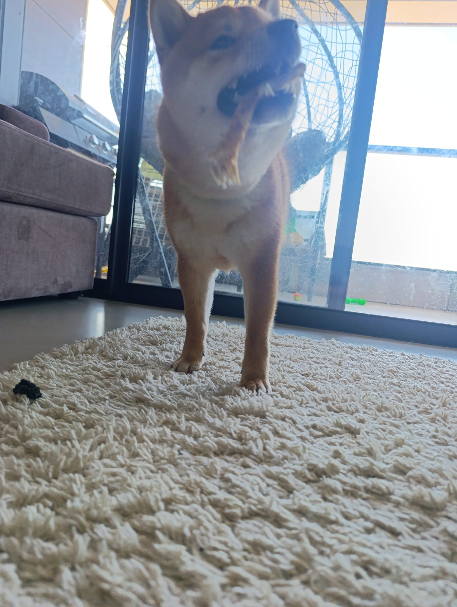
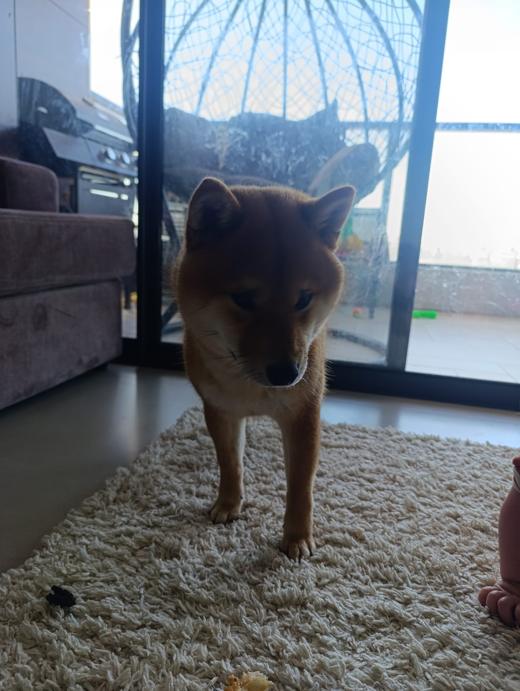

# 🐕 The dog behind BITE-OS

### `// THE SYSTEM BIT YOU`

---

This is **Laffy** — a Shiba Inu, and the reason BITE-OS exists.

It started as a project named after a wolf, made out of loving my dog. The name,
the fangs in the logo, the whole **"BITE"** — that's not edgy hacker branding.
It's *him.* The logo is a close-up of Laffy's mouth. **"// THE SYSTEM BIT YOU"**
is just Laffy play-biting. The teeth were always affection.

That's the spirit the whole OS is built on, if you look for it:

- **Loyal** — it guards you. The self-heal, the dot-switch watchdog, the rice
  vault: a system that won't let you get hurt, like a dog watching the house.
- **Never a leash** — it protects you and then lets you run. Edit anything, break
  anything, make it yours. BITE-OS gives you everything riced out of the box and
  then gets out of your way.

A Minecraft wolf — wild, then tamed, loyal, following you anywhere but never
leashed — is the whole arc of this project in one image. BITE-OS is that wolf,
with Laffy's heart.

I don't force my dog on anyone — you can theme BITE-OS into whatever you want.
But he's always in here somewhere, watching. That's the point.

**Good boy. Built different.** 🐾

`BITE-OS` · by **GLITCH-BITE404** · for **Laffy**

