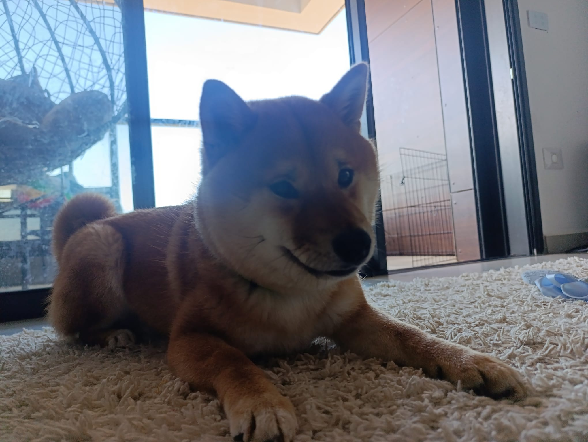
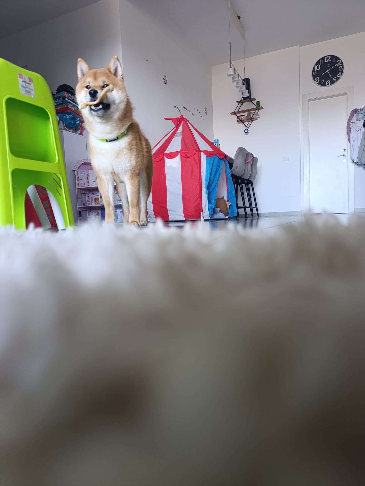
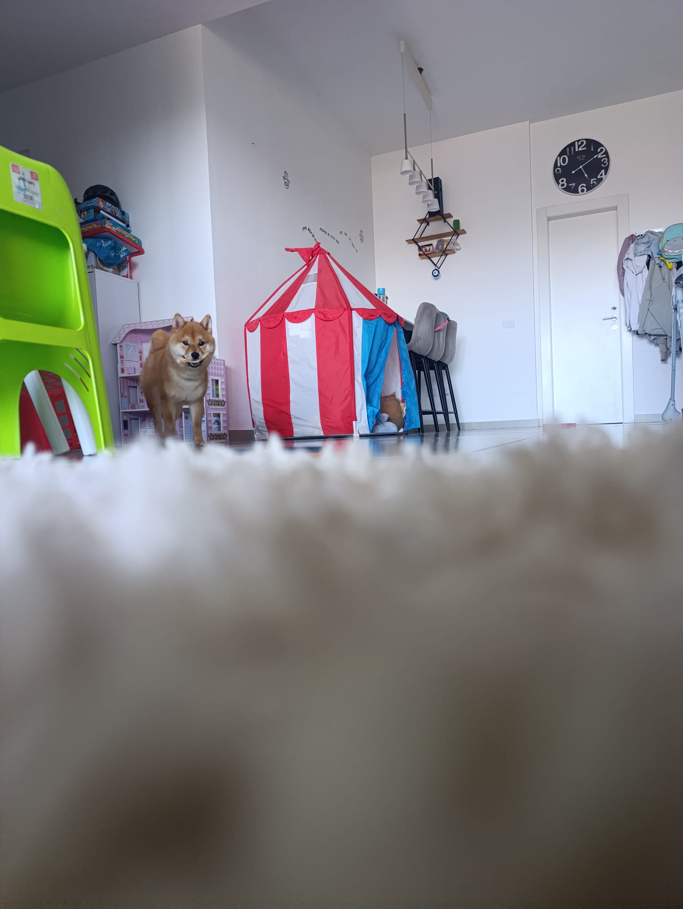
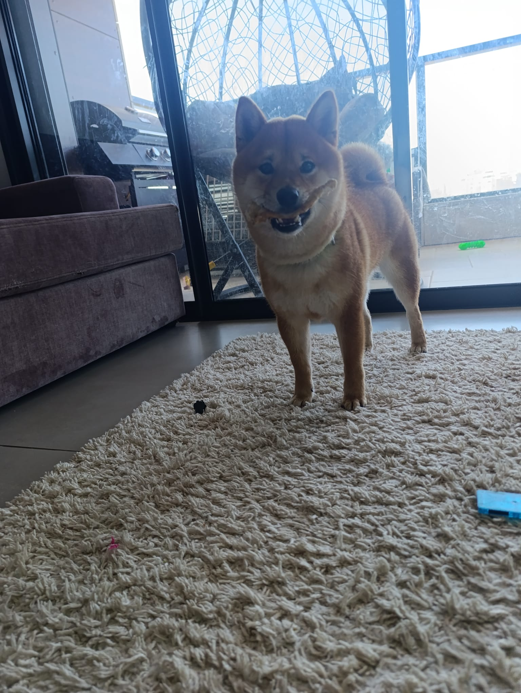

# 🐕 The story behind BITE-OS

### `// THE SYSTEM BIT YOU`

---

> **TL;DR** — BITE-OS is a glitch-themed Linux distro: CachyOS/Arch base, a full
> Hyprland rice, two swappable desktops, self-heal, and one-key updates. It's named
> after my Shiba Inu, **Laffy** 🐕 — and this page is the story of how it was born
> (short version: I bricked my system and rebuilt it into this).

---

## How it actually started

BITE-OS wasn't planned. I was running [ML4W](https://github.com/mylinuxforwork/dotfiles)
dotfiles and wanted to change my desktop and my rice — and I **bricked the whole
system** doing it. No desktop, no GUI, nothing.

So I fixed it the hard way: from a black **TTY**, on the CachyOS base, reprogramming
it by hand until it booted again. When it finally came back up… it had **no GUI at
all.** So I pulled [caelestia](https://github.com/caelestia-dots) down as a starting
template, **reprogrammed it from there**, and just kept going — added a second full
desktop, the dot-switch, the safety net, the branding, more and more — until it
became its own thing: **BITE-OS.**

That's why this OS is the way it is. **I lived the brick.** I know exactly what it
feels like to wreck your system at 2am and stare at a TTY. So BITE-OS is built so
**you can't do that to yourself** — the self-heal, the auto-revert dot-switch
watchdog, the rice vault. It catches you, because nothing caught me.

## Where the name comes from

The dog. This is **Laffy** — a Shiba Inu, and the reason it's called BITE-OS.

The fangs in the logo, the whole **"BITE"** — that's not edgy branding, it's *him.*
The logo is a close-up of Laffy's mouth. **"// THE SYSTEM BIT YOU"** is just Laffy
play-biting. The teeth were always affection.

That's the spirit underneath all the engineering:

- **Loyal** — it guards you. Self-heal, watchdog, vault: a system that won't let
  you get hurt, like a dog watching the house.
- **Never a leash** — it protects you, then lets you run. Edit anything, break
  anything, make it yours. Riced out of the box, then out of your way.

I don't force my dog on anyone — theme BITE-OS into whatever you want. But he's
always in here somewhere, watching. That's the point.

**Good boy. Built different.** 🐾

`BITE-OS` · by **GLITCH-BITE404** · for **Laffy**

