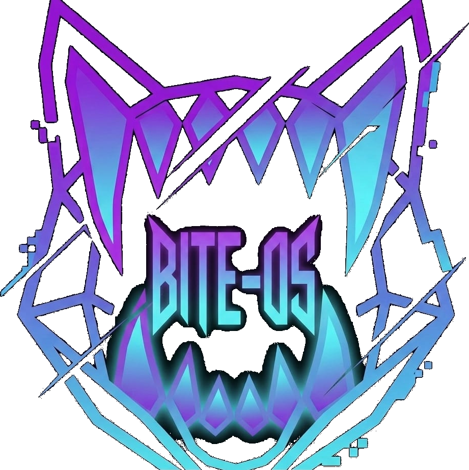

<div align="center">

# ▟▛▜▙ BITE-OS

### `// THE SYSTEM BIT YOU`



**A glitch-themed, performance-obsessed Linux distribution.**
Built on the CachyOS base — riced to the teeth, engineered to never get in your way.

`v1.0` · codename **dedsec** · by **GLITCH-BITE404**

[](https://www.tiktok.com/@glitch_bite404)


[](LICENSE)

**[⤓ Download](#-download)** · **[🛠 Built by hand](BUILT.md)** · **[🐕 Meet Laffy](LAFFY.md)**

</div>

---

> **TL;DR** — BITE-OS is a glitch-themed Linux distro on a CachyOS/Arch base: a full
> Hyprland rice, **two swappable desktops**, self-healing config, and **one-key system
> updates** — heavy looks, light idle. Grab the [ISO](#-download) and install in minutes.
> Named after my Shiba Inu, [Laffy](LAFFY.md) 🐕.

---

## ◈ Gallery

<!-- Drop your screenshots in assets/screenshots/ with these names (see that
     folder's README). Until then these links just won't render. -->

<div align="center">

| caelestia rice | ilyamiro rice |
|:---:|:---:|
|  |  |
| **Glitch dashboard** | **`// THE SYSTEM BIT YOU`** |
|  |  |
| **One-key self-update (`SUPER+U`)** | **Wallpaper / rice picker** |
|  |  |

</div>

---

## ◈ What makes it BITE

BITE-OS isn't a reskin. It ships things stock Arch and CachyOS simply don't have:

> ⚠️ **Developer Note:** Unlike basic rice builds, most of the system UI has been completely reprogrammed, optimized, and natively pre-riced from the ground up for zero-latency execution.

- **🦷 Dot-switch** — two *complete* desktops (`caelestia` + `ilyamiro`), swapped with **one keypress**. Every swap auto-backs-up your config, and a 30-second watchdog auto-reverts if anything breaks. You physically cannot get locked out.
- **⚙ Live GUI settings** — keybinds, language, weather, startup apps and dot-switching — all editable from an in-system panel. No text files. Configs recompile and reload instantly.
- **🛠 Self-repair** — a health check runs at every login and rebuilds a wiped config automatically. The OS fixes itself.
- **⬆ One-key update** — `SUPER+U` runs a full system update (kernel, apps, AUR, rice) that **keeps it BITE-OS** — branding is re-asserted on every upgrade, so it never decays into vanilla CachyOS.
- **⚡ Fast** — a full heavy glitch/DEDSEC rice that idles around **5% CPU** and holds **144 fps**. Performance is the whole point.
- **🌐 Keyless weather, glitch borders, animated everything** — and it still doesn't lag.

---

## ◈ Performance Engineering

The rice is heavy on purpose — and it still idles light because the *backend* is
tuned, not the effects stripped. Nothing here costs you a single blur or shader.

**Wallpaper engine (event-driven, single-instance):**
- Video wallpapers hardware-decode via **VAAPI** (`mpvpaper`), not the CPU.
- An auto-pause daemon **freezes the wallpaper (`SIGSTOP`) the instant a window
  goes fullscreen** and resumes it on exit — a fullscreen game/video pays ~0%
  wallpaper cost.
- A `flock` mutex + a `SIGCONT → SIGTERM → SIGKILL` teardown guarantee **exactly
  one wallpaper process** — no matter how fast you spam the dot/wallpaper picker,
  it never stacks "ghost" instances.
- `wall-optimize` ships as a tool: it re-rates any wallpaper video to 24fps
  (lossless to the eye on a loop), cutting decode/composite load **~20–50%**.
  Originals are always backed up, never destroyed.

**Compositor (Hyprland, tuned for mobile iGPU):**
- **Direct scanout + per-window tearing** — fullscreen games/video bypass the
  compositor entirely for lower latency and less GPU work. Only opt-in windows
  tear; the desktop never does.
- **Region damage tracking** (only redraw what changed), **VRR**, and blur passes
  tuned to the sweet spot for integrated graphics.
- Glitch/LARP mode toggles damage tracking around its shaders and **restores the
  exact prior state** on exit — effects are GPU shaders + paced event loops, not
  CPU busy-spinners.

**System base (CachyOS):**
- **zram** (zstd) compressed swap, **`ananicy-cpp`** process auto-prioritization,
  and the CachyOS performance kernel. Governor stays `powersave` — it still
  turbo-boosts under load, without the heat-throttling that *performance* invites
  on a laptop.

**Result:** a full glitch/DEDSEC rice that idles around **5–7% with a live video
wallpaper** (lower still on a static one) and holds **144 fps**.

---

## ◈ Does it match your vibe?

If your taste runs **cyber / glitch / DEDSEC-hacker** — neon-on-black, terminals that
look like a breach in progress, fangs in the logo, animated everything — BITE-OS is
built to feel like that **the second it boots**, no hours of ricing required. And if
your vibe is something else entirely, it bends: two complete desktops, a live theming
engine, and a rice vault mean you can reshape it into *yours* and never get locked out.
It's opinionated out of the box, infinitely yours after.

---

## ◈ Hand-built tooling

None of this is borrowed — it was written *for* BITE-OS. *(Full writeup: [`BUILT.md`](BUILT.md).)*

- **`glitch-fetch`** — a from-scratch fastfetch rewrite, built as a **pure-Bash "gacha"
  engine**: every time you open a terminal it rolls a **random logo** (Laffy, the BITE
  fangs, glitch art), **auto-detects that image's aspect ratio**, and renders it into a
  matching framed layout (centered / side-by-side / vertical) with a boxed, glyph-framed
  system readout. Per-shell caching keeps each session's pick stable. No two terminals
  look the same.
- **`rice`** — the **rice vault**: `rice save` / `load` / `rollback`. Snapshots your
  *entire* desktop, auto-backs-up before every swap, and reverts in one command. Your
  setup is a versioned artifact, not fragile dotfiles you pray over.
- **Dot-switch + watchdog** — flip between the two desktops with one key; a 30-second
  watchdog **auto-reverts if a swap breaks**. You physically cannot lock yourself out.
- **`bite-os-update` (`SUPER+U`)** — one-key full update (kernel / apps / AUR / rice)
  that **re-asserts branding** every time, so updates never decay it back to vanilla
  CachyOS. Optional, logged, asks first.
- **Self-heal** — a login healthcheck quietly rebuilds a wiped config. The OS fixes itself.
- **Glitch mode (`SUPER+B`)** — a LARP overlay: glitch shader, dedsec wallpaper, amber
  trace HUD and paced popups — engages and tears down cleanly, restoring your exact state.
- **Wallpaper engine** — single-instance VAAPI video wallpapers, an auto-pause daemon, a
  ghost-reaper so it never stacks, and `wall-optimize` to down-rate any wallpaper for
  lower idle CPU.

---

## ◈ Custom Keybinds Matrix

The system maps directly to these custom core inputs for elite navigation:

| Keybinding | Action | Execution Target |
|---|---|---|
| `SUPER + B` | **Hacker Aesthetic Overlay** | Triggers the "LARP" mode for full system cyber visual effects |
| `SUPER + T` | **Open Terminal** | Launches the pre-configured terminal environment instantly |
| `SUPER + Q` | **Close Window** | Safely terminates the active focused window |
| `SUPER + ALT + SPACE` | **Toggle Floating Mode** | Forces the active window into a floating layer |
| `SUPER + BACKSPACE` | **Hot-Swap to Ilyamiro** | Executes a rapid swap directly to the `ilyamiro` dots profile |
| `CTRL + SUPER + D` | **Hot-Swap to Caelestia** | Executes a rapid swap straight back to the `caelestia` dots profile |
| `SUPER + R` | **Reload Waybar** | Instantly recompiles and hot-reloads the Waybar panel |
| `SUPER + U` | **Update BITE-OS** | Full system update (kernel, apps, rice) with logs — stays BITE-OS |

---

## ◈ Download

> The ISO (~4.5 GB) is hosted off-GitHub due to file-size limits.

**➡ [Download BITE-OS 1.0 (dedsec)](https://archive.org/download/bite-os-1.0-x86_64_20260525/bite-os-1.0-x86_64.iso)**

`SHA256`: `b12376590eb00fc9da57639cd30267cd83f0fdfb6b272002b9c430e72d2bff35`

## ◈ Install

1. Flash the ISO to a USB (≥ 8 GB) with [Impression](https://apps.gnome.org/Impression/), [Ventoy](https://www.ventoy.net/), or `dd`.
2. Boot it. The ISO comes up **straight into the BITE-OS installer** — a dedicated, bulletproof installer environment (no desktop to fight, nothing to crash).
3. Click through it: language → keyboard → disk → *your* username + password → **Install**.
4. Reboot into your own riced BITE-OS — the full pre-riced Hyprland desktop, exactly as shipped.

No terminal required, no desktop to pick — BITE-OS installs as **one opinionated, pre-riced Hyprland system**, offline (no internet needed during install).

## ◈ Updating

BITE-OS keeps itself current **and stays BITE-OS** — updates never revert it to vanilla CachyOS.

- Press **`SUPER + U`**, or launch **Update BITE-OS** from the app menu, or run **`bite-os-update`** in a terminal.
- It updates *everything* (kernel, apps, AUR, the rice), is **optional** (asks first, only acts if there's something to do), and **logs** every run to `~/.local/state/bite-os/`.

## ◈ Source

The core engineered logic — dot-switch + watchdog, self-repair, the live
settings engine, the rice vault — lives in **[`src/`](src/)**, readable and
auditable with no build step. See [`src/README.md`](src/README.md) for the map.

## ◈ Packages & updates

BITE-OS is delivered as a **native pacman package** (`bite-os`) served from its
own **`[bite-os]` repo** — so the whole system (rices, themes, dot-switch engine,
glitch tooling, branding) updates the Arch-native way:

```bash
sudo pacman -Syu          # pull the latest BITE-OS alongside CachyOS/Arch updates
```

The `bite-os` package stages the rice vault and tooling into `/etc/skel`, so
every fresh install boots fully riced. Branding is pinned by `zz-bite-os-*`
pacman hooks that re-assert on every upgrade — system updates can't wash the
identity out.

The `[bite-os]` repo is **live**, hosted on GitHub Releases, and wired into
`/etc/pacman.conf` automatically on install — so `SUPER+U` / `pacman -Syu`
pulls new BITE-OS releases straight from this repository.

## ◈ Build it yourself

BITE-OS is assembled from this repo on an Arch / CachyOS host:

```bash
bash repo/build-repo.sh        # build the bite-os package + local repo
sudo pacman -S --needed archiso
sudo bash build-iso.sh         # build the ISO -> out/
```

> **Note:** the `bite-os` package payload (the rices, themes and tooling) is
> staged from a running BITE-OS system and is not committed here to keep the
> repo lean. The shipped ISO above is the ready-to-use build.

## ◈ License & Credit

BITE-OS is © 2026 **GLITCH-BITE404** and released under the **GNU General Public
License v3.0** ([`LICENSE`](LICENSE)). In short: you're free to use, study, share
and modify it — but **if you copy, fork, remix or redistribute BITE-OS you must
credit the author (GLITCH-BITE404), link back to this repo, keep your version
open-source under the same license, and not pass your fork off as the official
BITE-OS.** Full terms and the attribution requirements are in [`NOTICE`](NOTICE).

The bundled upstream packages (Hyprland, CachyOS base, Calamares, caelestia,
fonts, …) keep their own respective licenses.

---

<div align="center">

`// THE SYSTEM BIT YOU` — built by **GLITCH-BITE404**

🐕 *Named after, and built for, a Shiba Inu named Laffy — [meet him](LAFFY.md).*

</div>
